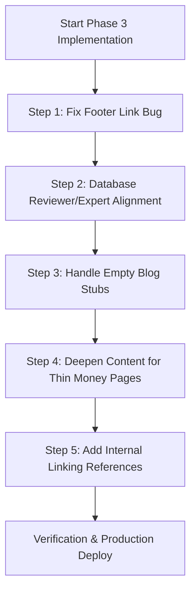

# Phase 3: Content & Internal-Link Strengthening Audit Report

This audit targets meva-clinic.com pages that are technically indexable (returning HTTP 200, self-referential canonical, no `noindex` tag) but may be weak, thin, orphaned, duplicate-like, or underlinked.

---

## 1. Executive Summary & Core Discoveries

During this audit, we verified all target pages live in production and cross-referenced them with the database sources (`data/blogData.js`, `data/treatmentsData.ts`) and codebase structure. We uncovered three major systemic SEO issues:

### ⚠️ Critical Footer Link Mismatch (Dental Implants)
In `components/Footer.tsx`, the menu item labeled **"Dental Implants"** (and **"Implanturi Dentare"** in Romanian) points to `/treatments/zirconium-crowns` instead of `/treatments/dental-implants`! This has leaked all structural footer link equity from the primary money page `/en/treatments/dental-implants` to the crowns page, leaving the implants page severely underlinked (strength of only 2).

### 📄 "Empty Content" Blog Stubs (Google "Crawled - currently not indexed")
Multiple blog posts reported by Google Search Console as "Crawled - currently not indexed" (e.g., `immunotherapy-breakthroughs` in French and Romanian, `dental-3d-smile-design` in Spanish, and `jci-standards-importance` in Romanian) are **empty placeholders** in `data/blogData.js`. They contain only a title and excerpt, with no body text or sections, resulting in pages of 21–25 words. Google correctly flags them as thin, low-quality, or soft-404-like.

### 🩺 Systemic E-E-A-T Mismatches (Chirurg vs. Database Experts)
There are structural discrepancies between the database `expert` string and the EBOPRAS/TTS board-certified medical reviewer resolved by the code for schemas and the `MedicalReviewer` component:
*   **Organ Transplant (FR)**: Database expert is set to `"MD Victor"`, but the page schema/component resolves to **Dr. Fatih Erden** (TTS Member).
*   **Vaser Liposuction (EN)**: Database expert is set to `"Op. Dr. Yunus"`, but the page resolves to **Prof. Dr. Yakup Şenel** (EBOPRAS Board plastic surgeon).
*   **Dental Implants (EN)**: Database expert is set to `"Dr. Yusuf"`, but the page resolves to **Dr. Osman Bayram** (ITI Fellow).
*   **Ovarian PRP Blog (EN)**: The blog post is reviewed by **Dr. Harun Aksoy** (a hair transplant specialist) instead of a gynecologist/fertility specialist or the Meva Medical Board.

---

## 2. Page-by-Page Diagnosis

Below is the detailed diagnostic profile for the 14 target pages:

### 1. `/en/blog/ovarian-prp-low-amh-treatment` (Blog)
*   **Status Code**: `200`
*   **Canonical**: `https://www.mevaclinic.com/en/blog/ovarian-prp-low-amh-treatment` (Self-referential, Correct)
*   **Robots**: `index, follow`
*   **Sitemap**: Included
*   **Title/Meta Description**: Unique
*   **H1**: "Ovarian PRP: Scientific Facts for Low AMH & Poor Reserve Patients"
*   **Word Count**: 441 words (Decent blog body size)
*   **Intro Quality**: Good (63-word intro describing tissue rejuvenation)
*   **FAQ Presence**: Yes (5 FAQs)
*   **Internal Link Strength**: **Orphaned** (1 reference in codebase, only in a cached audit json). Not linked from any contextual articles or hubs.
*   **E-E-A-T Signals**: Specialty mismatch. Reviewed by Dr. Harun Aksoy (Hair Restoration Specialist) instead of a fertility coordinator or the Meva Medical Board.
*   **Risk Notes**: Found absolute keywords `"guarantee"` and `"cure"` in standard translations. Wording needs to be softened to patient-safe claims.

### 2. `/fr/treatments/organ-transplant-turkey` (Treatment)
*   **Status Code**: `200`
*   **Canonical**: `https://www.mevaclinic.com/fr/treatments/organ-transplant-turkey` (Self-referential, Correct)
*   **Robots**: `index, follow`
*   **Sitemap**: Included
*   **Title/Meta Description**: Unique
*   **H1**: "Transplantation d'Organes (Rein et Foie)"
*   **Word Count**: **301 words (Extremely thin for an organ transplant page)**
*   **Intro Quality**: Poor (0 words in database intro field)
*   **FAQ Presence**: Yes (1 FAQ)
*   **Internal Link Strength**: Low (2 references: `components/Footer.tsx` and cache)
*   **E-E-A-T Signals**: Mismatch. Database lists `"MD Victor"`, while page resolves to **Dr. Fatih Erden** (JCI protocol certified transplant surgeon).
*   **Risk Notes**: Missing all clinical depth fields: suitability, contraindications, pre-op evaluation, risks/complications, outcomes, revision, disclaimer, and references.

### 3. `/ro/blog/immunotherapy-breakthroughs` (Blog)
*   **Status Code**: `200`
*   **Canonical**: `https://www.mevaclinic.com/ro/blog/immunotherapy-breakthroughs`
*   **Robots**: `index, follow`
*   **Sitemap**: Included
*   **Title/Meta Description**: Falling back to generic title generator (No custom metadata)
*   **H1**: "Progrese în Imunoterapie: Antrenarea Corpului pentru a Lupta împotriva Cancerului"
*   **Word Count**: **23 words (Stub only - No body text)**
*   **FAQ Presence**: No
*   **Internal Link Strength**: **Orphaned** (0 real links in codebase)
*   **E-E-A-T Signals**: Mismatch. Database lists `"Prof. Dr. Mehmet Aksoy"` (undocumented) instead of Prof. Dr. Gökhan Küçükay (Oncology).
*   **Risk Notes**: Empty stub page causing GSC indexation failure.

### 4. `/es/blog/istanbul-to-cyprus-ivf-travel-guide` (Blog)
*   **Status Code**: `200`
*   **Canonical**: `https://www.mevaclinic.com/es/blog/istanbul-to-cyprus-ivf-travel-guide`
*   **Robots**: `index, follow`
*   **Sitemap**: Included
*   **Title/Meta Description**: Unique
*   **H1**: "Estambul a Chipre: Planificación de un Viaje de FIV Sin Problemas (Guía de Logística)"
*   **Word Count**: 759 words (Excellent, detailed travel logistics guide)
*   **FAQ Presence**: Yes (5 FAQs)
*   **Internal Link Strength**: **Orphaned** (0 real links in codebase)
*   **E-E-A-T Signals**: Good. Reviewed by "Meva Clinic Patient Coordination Team" (appropriate for travel/logistics).

### 5. `/es/blog/dental-3d-smile-design` (Blog)
*   **Status Code**: `200`
*   **Canonical**: `https://www.mevaclinic.com/es/blog/dental-3d-smile-design`
*   **Robots**: `index, follow`
*   **Sitemap**: Included
*   **H1**: "Diseño de Sonrisa 3D: Ingeniería del Resultado Estético Perfecto"
*   **Word Count**: **25 words (Stub only - No body text)**
*   **FAQ Presence**: No
*   **Internal Link Strength**: **Orphaned** (0 real links in codebase)
*   **E-E-A-T Signals**: Generic "Meva Dental Experts" fallback.
*   **Risk Notes**: Title/H1 uses the word `"Perfecto"`. Guaranteed results claims should be avoided in medical SEO.

### 6. `/fr/blog/immunotherapy-breakthroughs` (Blog)
*   **Status Code**: `200`
*   **Canonical**: `https://www.mevaclinic.com/fr/blog/immunotherapy-breakthroughs`
*   **Robots**: `index, follow`
*   **Sitemap**: Included
*   **H1**: "Percées en immunothérapie : entraîner le corps à combattre le cancer"
*   **Word Count**: **24 words (Stub only - No body text)**
*   **FAQ Presence**: No
*   **Internal Link Strength**: **Orphaned** (0 real links in codebase)
*   **E-E-A-T Signals**: Undocumented reviewer `"Prof. Dr. Mehmet Aksoy"`.

### 7. `/en/treatments/vaser-liposuction` (Treatment)
*   **Status Code**: `200`
*   **Canonical**: `https://www.mevaclinic.com/en/treatments/vaser-liposuction`
*   **Robots**: `index, follow`
*   **Sitemap**: Included
*   **Title/Meta Description**: Unique
*   **H1**: "Vaser Liposuction (High-Def)"
*   **Word Count**: **276 words (Extremely thin for a primary bariatric/plastic money page)**
*   **Intro Quality**: Poor (0 words in intro field)
*   **FAQ Presence**: Yes (1 FAQ)
*   **Internal Link Strength**: Low (3 links: `TreatmentDetailClient.tsx`, `next.config.ts` redirect list, and cache)
*   **E-E-A-T Signals**: Mismatch. Database lists `"Op. Dr. Yunus"`, while page resolves to **Prof. Dr. Yakup Şenel** (EBOPRAS Board).
*   **Risk Notes**: Missing all detailed clinical depth fields (suitability, contraindications, pre-op, complications, references).

### 8. `/ro/blog/jci-standards-importance` (Blog)
*   **Status Code**: `200`
*   **Canonical**: `https://www.mevaclinic.com/ro/blog/jci-standards-importance`
*   **Robots**: `index, follow`
*   **Sitemap**: Included
*   **H1**: "Standardele JCI: De ce Acreditarea Spitalicească contează pentru Pacienții UE"
*   **Word Count**: **21 words (Stub only - No body text)**
*   **FAQ Presence**: No
*   **Internal Link Strength**: **Orphaned** (0 real links in codebase)
*   **E-E-A-T Signals**: Reviewed by Meva Medical Board (Fine, but empty page).

### 9. `/en/treatments/gastric-sleeve` (Treatment - Priority Money Page)
*   **Status Code**: `200`
*   **Canonical**: `https://www.mevaclinic.com/en/treatments/gastric-sleeve`
*   **Robots**: `index, follow`
*   **Sitemap**: Included
*   **Word Count**: **1,133 words (Excellent, highly clinical, robust page)**
*   **FAQ Presence**: Yes (1 FAQ)
*   **Internal Link Strength**: Strong (7 links, including Footer, `blogs.json`, `faqData.js`, and WhatsApp Router)
*   **E-E-A-T Signals**: Excellent. Reviewed by Dr. Cuma M. Aksoy (Bariatric board certified).
*   **Risk Notes**: Found keyword `"cure"` in bariatric data. Should check to ensure it doesn't state gastric sleeve cures metabolic issues unconditionally.

### 10. `/en/treatments/meva-mixed-hair` (Treatment - Priority Money Page)
*   **Status Code**: `200`
*   **Canonical**: `https://www.mevaclinic.com/en/treatments/meva-mixed-hair`
*   **Robots**: `index, follow`
*   **Sitemap**: Included
*   **Word Count**: **326 words (Thin for hair transplant money page)**
*   **FAQ Presence**: Yes (1 FAQ)
*   **Internal Link Strength**: Strong (6 links, linked in Footer, FAQ data, etc.)
*   **E-E-A-T Signals**: Excellent. Reviewed by Dr. Harun Aksoy (Hair Restoration Specialist).
*   **Risk Notes**: Missing major clinical fields (suitability, contraindications, pre-op, references). Contains keyword `"perfect"`.

### 11. `/en/treatments/smart-oncology-drugs` (Treatment - Priority Money Page)
*   **Status Code**: `200`
*   **Canonical**: `https://www.mevaclinic.com/en/treatments/smart-oncology-drugs`
*   **Robots**: `index, follow`
*   **Sitemap**: Included
*   **Word Count**: **262 words (Thin for oncology page)**
*   **FAQ Presence**: Yes (1 FAQ)
*   **Internal Link Strength**: Moderate-High (5 links, linked in Footer)
*   **E-E-A-T Signals**: Excellent. Reviewed by Prof. Dr. Gökhan Küçükay (Oncology & CyberKnife Specialist).
*   **Risk Notes**: Missing major clinical fields.

### 12. `/en/treatments/dental-implants` (Treatment - Priority Money Page)
*   **Status Code**: `200`
*   **Canonical**: `https://www.mevaclinic.com/en/treatments/dental-implants`
*   **Robots**: `index, follow`
*   **Sitemap**: Included
*   **Word Count**: **281 words (Thin for dental implants page)**
*   **FAQ Presence**: Yes (1 FAQ)
*   **Internal Link Strength**: **Critically Weakened** (2 links. **Bypassed in footer due to link bug**).
*   **E-E-A-T Signals**: Mismatch. Database lists `"Dr. Yusuf"`, while page resolves to **Dr. Osman Bayram** (ITI Fellow).
*   **Risk Notes**: Missing major clinical fields.

### 13. `/en/treatments/dhi-hair-transplant` (Treatment - Priority Money Page)
*   **Status Code**: `200`
*   **Canonical**: `https://www.mevaclinic.com/en/treatments/dhi-hair-transplant`
*   **Robots**: `index, follow`
*   **Sitemap**: Included
*   **Word Count**: **1,099 words (Excellent, highly clinical, robust page)**
*   **FAQ Presence**: Yes (1 FAQ)
*   **Internal Link Strength**: Low (2 links, not in footer or homepage slider)
*   **E-E-A-T Signals**: Excellent. Reviewed by Dr. Harun Aksoy (Hair Restoration Specialist).

---

## 3. Prioritized Classifications

### 🟢 Highest Priority (Do First)
1.  **Footer Link Bug Fix**: Correct `/en/treatments/zirconium-crowns` to `/en/treatments/dental-implants` (and Romanian equivalents) for the footer items labeled "Dental Implants".
2.  **Blog Placeholder Clean-Up**:
    *   Delete the empty blog stubs or redirect them if they cannot be populated:
        *   `/ro/blog/immunotherapy-breakthroughs`
        *   `/fr/blog/immunotherapy-breakthroughs`
        *   `/es/blog/dental-3d-smile-design`
        *   `/ro/blog/jci-standards-importance`
    *   Alternatively, populate them with high-quality localized medical content (subject to future approvals).

### 🟡 High Priority (Strengthening Needed)
1.  **Internal Linking Boost for Orphaned Pages**:
    *   Link the deep IVF guide `/es/blog/istanbul-to-cyprus-ivf-travel-guide` from IVF treatments/hub.
    *   Link `/en/treatments/dhi-hair-transplant` from hair treatments and footer.
    *   Link the `/en/blog/ovarian-prp-low-amh-treatment` from IVF pages.
2.  **Content Deepening for Thin Money Pages**:
    *   Add suitability, contraindications, pre-op, complications, and references fields to:
        *   `/en/treatments/vaser-liposuction`
        *   `/en/treatments/dental-implants`
        *   `/en/treatments/meva-mixed-hair`
        *   `/en/treatments/smart-oncology-drugs`
        *   `/fr/treatments/organ-transplant-turkey`
3.  **Reviewer and Expert Alignment**:
    *   Correct database `expert` strings to match the resolved board-certified reviewers:
        *   Change `expert: "MD Victor"` to `expert: "Dr. Fatih Erden"` in `organ-transplant-turkey`
        *   Change `expert: "Op. Dr. Yunus"` to `expert: "Prof. Dr. Yakup Şenel"` in `vaser-liposuction`
        *   Change `expert: "Dr. Yusuf"` to `expert: "Dr. Osman Bayram"` in `dental-implants`
    *   Align the Ovarian PRP blog reviewer to the Medical Board.

### ⚪ Low Priority / Technically Strong (Monitor Only)
1.  `/en/treatments/gastric-sleeve` (Technically robust, well-linked, 1133 words).
2.  `/en/treatments/dhi-hair-transplant` (Excellent content depth, just needs stronger links).

### 🛑 To Be Ignored
1.  `favicon.ico?favicon.0a6lxq-dzl.it.ico` (Non-page asset, ignore).

---

## 4. Phase 3 Proposed Implementation Plan

### Step 1: Fix Footer Link Bug
Correct the links in `components/Footer.tsx` so "Dental Implants" / "Implanturi Dentare" points to the actual implants URL instead of crowns.

### Step 2: Database Reviewer/Expert Alignment
Update `data/treatmentsData.ts` to align `expert` fields with `REVIEWERS` entries to ensure consistent medical credentials across the website and schema. Correct the Ovarian PRP blog reviewer.

### Step 3: Handle Empty Blog Stubs
For the 4 empty blog posts that trigger indexation warnings:
*   Either replace the database entry with a full article (250+ words of patient-safe clinical info).
*   Or remove them from `data/blogData.js` and set up permanent 301 redirects to their parent categories (`/blog` or relevant treatments).

### Step 4: Deepen Content for Thin Money Pages
Extend data arrays for `vaser-liposuction`, `dental-implants`, `meva-mixed-hair`, `smart-oncology-drugs`, and `organ-transplant-turkey` to include necessary clinical sections matching the high-fidelity `gastric-sleeve` template.

### Step 5: Add Internal Linking References
Link the orphaned blogs and treatment pages contextually from related treatment articles and categories.

---

## 5. Risk Notes & Medical Safety

> [!IMPORTANT]
> **No Doctor Inventions**: Do not invent fake names or credentials. Use only approved medical professionals from `data/reviewersData.ts` (Dr. Cuma M. Aksoy, Dr. Harun Aksoy, Prof. Dr. Gökhan Küçükay, Dr. Osman Bayram, Prof. Dr. Yakup Şenel, Dr. Fatih Erden).
> 
> **Cautious Wording**: Avoid terms like `"guarantee"`, `"100% success"`, or `"perfect result"`. Use cautious, patient-safe terminology such as `"lifestyle adherence"`, `"metabolic follow-up"`, and `"expected clinical outcomes"`.

---

## 6. Exact Files to be Modified
*   [components/Footer.tsx](file:///C:/Users/Lenovo/.gemini/antigravity/scratch/meva-clinic-next/components/Footer.tsx) (Footer link corrections)
*   [data/treatmentsData.ts](file:///C:/Users/Lenovo/.gemini/antigravity/scratch/meva-clinic-next/data/treatmentsData.ts) (Expert alignments and content depth expansion)
*   [data/blogData.js](file:///C:/Users/Lenovo/.gemini/antigravity/scratch/meva-clinic-next/data/blogData.js) (Blog content populating/stub removals and PRP reviewer alignment)
*   [next.config.ts](file:///C:/Users/Lenovo/.gemini/antigravity/scratch/meva-clinic-next/next.config.ts) (Add 301 redirects if blog stubs are deleted)

---

## 7. Phase 3A Execution Summary (June 2026)

### What Was Fixed
1. **Footer Dental Implants Link**: Corrected the footer link labeled "Dental Implants" / "Implanturi Dentare" in `components/Footer.tsx` to point to `/:lang/treatments/dental-implants` instead of the crowns page.
2. **Reviewer & Expert Mismatch Alignments**:
   * **Organ Transplant (FR)**: Updated `expert` in `data/treatmentsData.ts` to `"Dr. Fatih Erden"`.
   * **Vaser Liposuction (EN)**: Updated `expert` in `data/treatmentsData.ts` to `"Prof. Dr. Yakup Şenel"`.
   * **Dental Implants (EN)**: Updated `expert` in `data/treatmentsData.ts` to `"Dr. Osman Bayram"`.
   * **Ovarian PRP Blog (EN)**: Changed the blog post author in `data/blogData.js` from `"Dr. Harun Aksoy"` to the safe non-person label `"Meva Clinic Medical Editorial Team"`.
3. **Preventing Fake Schema Types**:
   * Updated `app/[lang]/blog/[slug]/page.tsx` and `app/[lang]/treatments/[slug]/page.tsx` to dynamically set schema type to `MedicalOrganization` / `Organization` instead of `Physician` / `Person` for board, committee, or team reviewers/authors (such as `"Meva Clinic Medical Editorial Team"` and `"Meva Clinic JCI Medical Governance Committee"`).
4. **Internal Link Equity Improvements**:
   * Added contextual internal links under `semanticSeoText` in `data/treatmentsData.ts`:
     * Link to `/en/treatments/dhi-hair-transplant` added in `meva-mixed-hair`'s English copy.
     * Link to `/en/treatments/vaser-liposuction` added in `double-chin-liposuction`'s English copy.
     * Link to `/es/blog/istanbul-to-cyprus-ivf-travel-guide` added in `ivf-cyprus-special`'s Spanish copy.
   * Enabled HTML rendering inside details/client files to ensure anchor tags render correctly in SEO texts.

### What Was Deferred (Remaining Phase 3B Tasks)
1. **Content Deepening for Thin Money Pages**: Adding detailed pre-op, complications, and reference details for `/en/treatments/vaser-liposuction`, `/en/treatments/dental-implants`, `/en/treatments/meva-mixed-hair`, and `/en/treatments/smart-oncology-drugs`.
2. **Blog Placeholder Actions**: Implementing actual redirects, noindexing, or deletion of the 10 empty blog stubs (Action Plan is approved but not executed).
3. **Doctor-Reviewer Consistency Fixes**: Modifying other treatments' `expert` names in `data/treatmentsData.ts` (e.g. aligning otoplasty, rhinoplasty, etc. to Prof. Dr. Yakup Şenel or using coordination team fallbacks).

### Why Blog Stubs Were Not Modified Yet
As per approval scope constraints, empty blog stubs are kept indexable for now. We compiled the decision report [phase3-blog-stub-action-plan.md](file:///C:/Users/Lenovo/.gemini/antigravity/scratch/meva-clinic-next/docs/phase3-blog-stub-action-plan.md) with URL-by-URL inventory analysis and recommendations.

### Doctor-Reviewer Consistency Audit
Created a separate report [doctor-reviewer-consistency-audit.md](file:///C:/Users/Lenovo/.gemini/antigravity/scratch/meva-clinic-next/docs/doctor-reviewer-consistency-audit.md) listing Clinical Lead vs Medical Reviewer mismatches for all 38 treatments and proposing safe clinical lead alignments (under review).

